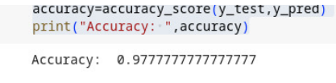

# Bayes-Classifier
## Aim:
To Construct a Bayes Classifier to classiy iris dataset using Python.
## Algorithm:
Input: 
- X: the training data, where each row represents a sample and each column represents a feature.
- y: the target labels for the training data.
- X_test: the testing data, where each row represents a sample and each column represents a feature.

Output:
- y_pred: the predicted labels for the testing data.

1. Create a BayesClassifier class with the following methods:
   a. __init__ method to initialize the Gaussian Naive Bayes classifier from scikit-learn.
   b. fit method to fit the classifier to the training data using the Gaussian Naive Bayes algorithm from scikit-learn.
   c. predict method to make predictions on the testing data using the fitted classifier from scikit-learn.
2. Load the Iris dataset using the load_iris function from scikit-learn.
3. Split the data into training and testing sets using the train_test_split function from scikit-learn.
4. Create a BayesClassifier instance.
5. Train the classifier on the training data using the fit method.
6. Make predictions on the testing data using the predict method.
7. Evaluate the classifier's accuracy using the accuracy_score function from scikit-learn.

## Program:
```
from pgmpy.models import BayesianNetwork
from pgmpy.factors.discrete import TabularCPD
from pgmpy.inference import VariableElimination
network=BayesianNetwork([('Burglary','Alarm'),('Earthquake','Alarm'),
('Alarm','JohnCalls'),
('Alarm','MarryCalls')])
cpd_burglary=TabularCPD(variable='Burglary',variable_card=2,values=[[0.999],[0.001]])
cpd_earthquake=TabularCPD(variable='Earthquake',variable_card=2,values=[[0.998],[0.002]])
cpd_alarm=TabularCPD(variable='Alarm',variable_card=2,values=[[0.999,0.71,0.06,0.05],
[0.001,0.29,0.94,0.95]],evidence=['Burglary','Earthquake'],evidence_card=[2,2])
cpd_john_calls=TabularCPD(variable='JohnCalls',variable_card=2,values=[[0.95,0.1],
[0.05,0.9]],evidence=['Alarm'],evidence_card=[2])
cpd_marry_calls=TabularCPD(variable='MarryCalls',variable_card=2,values=[[0.99,0.3],
[0.01,0.7]],evidence=['Alarm'],evidence_card=[2])
network.add_cpds(cpd_burglary,cpd_earthquake,cpd_alarm,cpd_john_calls,cpd_marry_calls)
inference=VariableElimination(network)
evidence={'JohnCalls':1,'MarryCalls':0}
query_variable='Burglary'
result=inference.query(variables=[query_variable],evidence=evidence)
print(result)
```

## Output:

## Result:
Hence, Bayes classifier for iris dataset is implemented successfully


